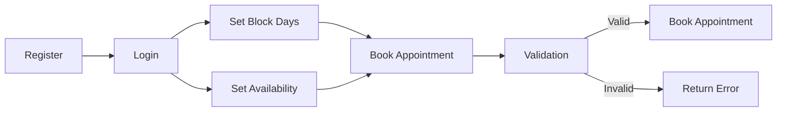

# 🗕 Doctor Appointment Booking System API Documentation (NestJS)

---

## 💡 Overview

This document outlines the RESTful API design and flow for a **Doctor Appointment Booking System** built using **NestJS**, **PostgreSQL**, and JWT-based authentication.

---

## 🔑 Authentication

All secure endpoints require a **Bearer Token** in the header after successful login.

---

## 1. 👤 User Registration (Doctor / Patient / Admin)

### **Endpoint:** `POST /users/register`

**Headers:**

```http
Content-Type: application/json
```

**Payload:**

```json
{
  "name": "John Doe",
  "email": "john@example.com",
  "password": "secure123",
  "role_id": 2,
  "specialization_ids": [1, 2]
}
```

**Flow:**

* `role_id = 2` (doctor) must include `specialization_ids`.
* Validate email uniqueness.
* Password hashing using bcrypt.
* Insert into `users` table.
* Insert doctor specializations in `doctor_specializations` table.

**Responses:**

* `200 OK`: `{ message: "User registered successfully", user: { ... } }`
* `400 Bad Request`: For missing email, duplicate email, or missing specialization.

---

## 2. 🔐 Login + JWT Issuance

### **Endpoint:** `POST /auth/login`

**Headers:**

```http
Content-Type: application/json
```

**Payload:**

```json
{
  "email": "john@example.com",
  "password": "secure123"
}
```

**Flow:**

* Validate credentials, lookup user by email.
* Password comparison with bcrypt.
* Return JWT token on success.

**Responses:**

* `200 OK`: `{ access_token: "...", user: { id: ..., role_id: ... } }`
* `401 Unauthorized`: "Invalid email or password"

---

## 3. 👩‍⚕️ Doctor Set Block Days

### **Endpoint:** `POST /doctor-blocks/block-days`

**Headers:**

```http
Authorization: Bearer <token>
Content-Type: application/json
```

**Payload:**

```json
{
  "user_id": "doctor_uuid",
  "block_type": "weekly",
  "dates": [
    { "recurring_day": "Monday" },
    { "recurring_day": "Wednesday" }
  ]
}
```

**Flow:**

* Guard: Only accessible by doctors (role\_id = 2).
* Save in `doctor_block_groups` and `doctor_block_dates`.

**Responses:**

* `200 OK`: `{ message: "Doctor block days created successfully" }`
* `403 Forbidden`: If not a doctor.

---

## 4. 🕒 Doctor Set Availability (Optional)

### **Endpoint:** `POST /doctor-availabilities/set-availability`

**Headers:**

```http
Authorization: Bearer <token>
Content-Type: application/json
```

**Payload:**

```json
{
  "user_id": "doctor_uuid",
  "start_time": "08:00",
  "end_time": "20:00"
}
```

**Flow:**

* Save into DB.
* If not set, fallback to ENV values (08:00 - 20:00).

---

## 5. 🗓 Book Appointment

### **Endpoint:** `POST /appointments/book`

**Headers:**

```http
Authorization: Bearer <token>
Content-Type: application/json
```

**Payload:**

```json
{
  "doctor_id": "doctor_uuid",
  "appointment_date": "2025-08-10",
  "start_time": "10:00",
  "end_time": "10:30"
}
```

**Validation Flow:**

1. **Minimum Duration:** Must be ≥ `MIN_APPOINTMENT_DURATION_MINUTES` from ENV.
2. **Availability Check:** Ensure selected time is within doctor's availability.
3. **Block Day Check:** Check if the selected date is blocked (via isDateBlocked).
4. **Doctor Overlap:** Ensure doctor is not already booked in that slot.
5. **Patient Overlap:** Ensure the patient doesn't have an overlapping appointment with the same doctor at the same time.
6. If all pass, appointment will be booked with status `booked`.

**Responses:**

* `200 OK`: Full appointment record.
* `400 Bad Request`: Errors for invalid timings, blocked dates, overlaps, etc.

---

## 6. 🕒 Get Doctor Availability (Optional)

### **Endpoint:** `GET /doctor-availabilities/my-availability`

**Headers:**

```http
Authorization: Bearer <token>
```

**Response:**

```json
{
  "start_time": "08:00",
  "end_time": "20:00"
}
```

---

## 📈 Flow Diagram Summary



---

## 📄 Future Enhancements

* Swagger/OpenAPI Documentation.
* `GET /appointments/list` for patient & doctor to see upcoming appointments.
* Admin panel for managing users.
* Pagination & filtering doctors by specialization.

---

## ⏳ Quick Summary

1. **Register** (Doctor/Patient/Admin)
2. **Login** & get JWT
3. **Doctor blocks days** they are unavailable.
4. **Doctor sets availability timing**.
5. **Patients book appointments** with validations.

---

# 🗕 END of API DOC